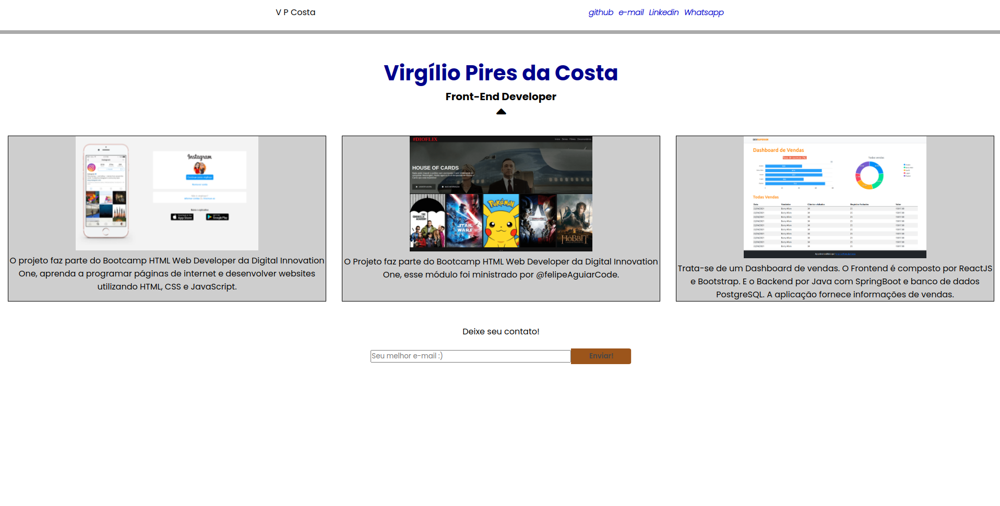

<h2 align="center">Portfólio</h2>

<h3 align="center">
  <a href="#information_source-sobre">Sobre</a>&nbsp;|&nbsp;
  <a href="#interrobang-motivo">Motivo</a>&nbsp;|&nbsp;
  <a href="#seedling-requisitos-mínimos">Requisitos</a>&nbsp;|&nbsp;
  <a href="#rocket-tecnologias-utilizadas">Tecnologias</a>&nbsp;|&nbsp;
  <a href="#licença">Licença</a>
</h3>

  

## :information_source: Sobre

Portfólio

Exercitar os conhecimentos de forma sobre HTML5, CSS3(foco principal deste projeto) e JavaScript. 

## :interrobang: Motivo

Projeto faz parte do Hiring Coders #3 da [Gama Academy], esse módulo foi ministrado por [Kai Pimenta](https://github.com/kpmnta).

## :seedling: Requisitos Mínimos

Navegador de internet

## :rocket: Tecnologias Utilizadas 

O projeto foi desenvolvido utilizando as seguintes tecnologias

- HTML5
- CSS3
- JavaScript
- JQuery

## Licença 

Esse projeto está sob a licença MIT. Veja o arquivo [LICENSE](LICENSE) para mais detalhes.

  

