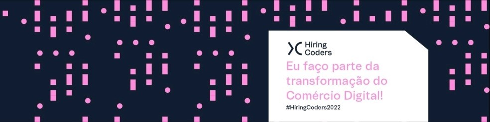

<h2 align="center">Hiring Coders #3</h2>

  

---

<h3 align="center">
    <a href="#information_source-sobre">Sobre</a>&nbsp;|&nbsp;
  <a href="#interrobang-motivo">Motivo</a>&nbsp;|&nbsp;
  <a href="#seedling-requisitos-mínimos">Requisitos</a>&nbsp;|&nbsp;
  <a href="#rocket-tecnologias-utilizadas">Material de Referência e Tecnologias Utlizadas</a>&nbsp;|&nbsp;
  <a href="#licença">Licença</a>
</h3>

---

  

## :information_source: Sobre

Somos o programa de capacitação gratuito e sem pré-requisitos para te ensinar programação, digital commerce e como ter uma carreira à prova do futuro.

O bootcamp é composto por 03 níveis (Front-End, Back-End, VTEX IO e Desafio final). 

Além de Lean Mindset, Digital Skills, Problem Solvimg, Metodologia Ágil, GIT, Dados, Boas Práticas, Devops + AWS, Projetos de ecommerce, Digital Commerce, Soft Skills, Estrutura de dados dentre outros. 

## :seedling: Requisitos Mínimos

Navegador web, documentação e editor de código.

# :rocket: Material de Referência e Tecnologias Utilizadas

O projeto foi desenvolvido utilizando as seguintes tecnologias

- [HTML básico](https://www.w3schools.com/html/)
- [CSS básico](https://developer.mozilla.org/pt-BR/docs/Web/CSS)
- [Javascript](https://developer.mozilla.org/pt-BR/docs/Web/JavaScript)
- [Markdown](https://docs.pipz.com/central-de-ajuda/learning-center/guia-basico-de-markdown#open)
- [GIT] (https://git-scm.com/docs/git/pt_BR)
- [React] (https://pt-br.reactjs.org/docs/getting-started.html)
- [Node.js] (https://nodejs.org/pt-br/docs/)
- [Typescript] (https://www.typescriptlang.org/docs/)
- [GraphQl] (https://graphql.org/learn/)
- [Next.js] (https://nextjs.org/docs)
- [Gatsby] (https://www.gatsbyjs.com/docs/)

## Licença

Esse projeto está sob a licença MIT. Veja o arquivo [LICENSE](LICENSE) para mais detalhes.

## 🚀 Let's code! 🚀
